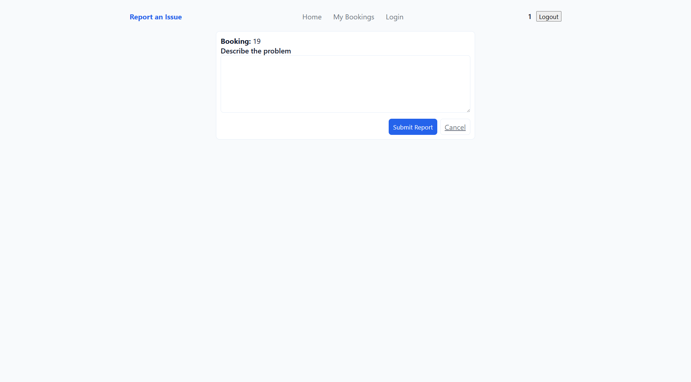

# Lab Equipment Booking 
A real-time web application designed to manage and streamline the reservation of laboratory instruments.

🚀 Features
- Interactive Booking Grid: A dynamic schedule (09:00 - 20:00) showing real-time availability for all lab equipment.

- Smart Visual Cues:

    - Red Slots: Your own active bookings.

    - Grey Slots: Equipment reserved by other users (non-clickable).

- Advanced "My Bookings" Management:

    - Multi-criteria Filtering: Filter by equipment name, specific date, or hide canceled reservations using a modern horizontal filter bar.

    - Time-Sensitive Actions: The system automatically hides the "Cancel" button for past reservations while keeping the "Report Issue" option available.

- Security First:

    - Secure Authentication with BCRYPT password hashing.

    - Full protection against SQL Injections using Prepared Statements.

    - Session-based access control for private pages.

🛠️ Installation

Prerequisites
    - A local server environment (XAMPP, WAMP, MAMP, or LAMP).

    - PHP 7.4+

    - MySQL/MariaDB

Setup
1. Database: Create a database named lab_equipment.

2. Tables: Import your SQL schema.

    - Note: Ensure the password column in the user table is set to VARCHAR(255) to accommodate the secure hash.

3. Files: Clone or move the project files into your server's root directory (e.g., htdocs or var/www/html).

4. Database Connection: If necessary, update the credentials in the PHP files ($servername, $username, $password).

📂 Project Structure
- index.php: The main dashboard featuring the equipment/time booking matrix.

- app.js: Core frontend logic, including the dynamic modal system and asynchronous API calls.

- styles.css: Global styling, featuring custom variables for easy theme adjustments and responsive layouts.

- mybookings.php: Personal user area with advanced filtering logic and booking history.

- login.php / register.php: Secure entry points for user management.

- create_reservation.php / cancel_booking.php: Backend API endpoints for database transactions.

📝 Usage
1. Register/Login: Create an account to start booking.

2. Select a Date: Use the date picker on the Home page to view availability for a specific day.

3. Book a Slot: Click on an empty cell. A confirmation modal will appear.

4. Manage: Go to "My Bookings" to view your history. Use the horizontal filter bar to find specific entries or report an issue with a past booking.    

## System Design (ERD)

This application was developed based on the database structure defined in the following Entity-Relationship Diagram.

*Figure 1: System Database Schema*

### Application Screenshots

Below is a visual overview of the user interface and key features:

| **1. Log in Page** | **2. Default Homepage** |
| :--- | :--- |
|  Entry point for user authentication to access booking features. |  The main dashboard displaying the schedule grid and equipment availability. |

| **3. Booking an Equipment** | **4. Booking Multiple Equipments** |
| :--- | :--- |
|  Users can select specific time slots to make a single reservation. |  Support for selecting and reserving multiple slots or different equipment simultaneously. |

| **5. My Bookings** | **6. Report Issue** |
| :--- | :--- |
|  A personalized view for users to manage their active reservations. |  Interface allowing users to submit problem reports for specific equipment bookings. ||

